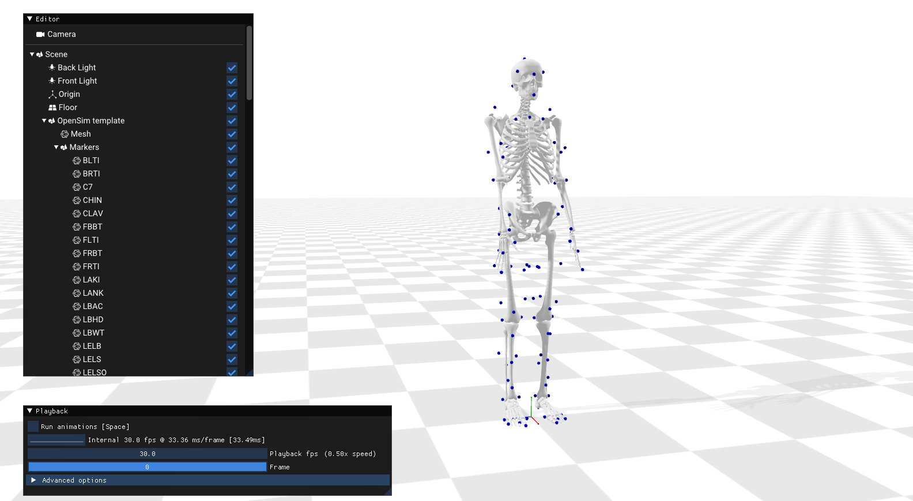

# REMI - Real-time SMPL Visualization with Aitviewer

This repository contains the Aitviewer-based visualization component for the REMI project. It's designed to receive SMPL parameters from a pose estimation client (like the one in the `ipman-r-RT` repository) and render a 3D human mesh in real-time. This allows for a decoupled system where pose estimation and visualization can run as separate processes.

**Main REMI Project Page:** (https://dominickstephens.github.io/REMI_page/)
**Ipman-R (Real-time Pose Estimation) Component:** [https://github.com/Dominickstephens/ipman-r-RT](https://github.com/Dominickstephens/ipman-r-RT)

## Overview of this Repository (aitviewer-skel-RT)

This repository provides:
* A custom Aitviewer server tailored to receive and display SMPL data.
* Relay scripts that act as intermediaries: they receive data from the pose estimation client (e.g., `webcam_client.py` from `ipman-r-RT`) and forward it to the Aitviewer server.
* Implementations of various filtering techniques (OneEuro, Single Exponential, Double Exponential, Moving Average) within the relay scripts to smooth the incoming pose data before visualization.
* A metrics-gathering version of the relay script to evaluate the impact of these filters.

## Scripts

``` bash
python examples/custom_smpl_server.py
```

This script starts the Aitviewer server. It's configured to listen for incoming connections (typically from one of the relay scripts below) and render RemoteSMPLSequence objects. The server displays a 3D environment with a floor, ready to visualize the animated SMPL model based on the data it receives.

``` bash
python remote_smpl2.py
```

This script acts as a relay client/server.

Server Role: It listens for connections from a pose estimation client (e.g., webcam_client.py from the ipman-r-RT repository, which sends raw SMPL parameters).
Client Role: It connects to the custom_smpl_server.py (Aitviewer server).
Functionality: It receives raw SMPL data, creates a RemoteSMPLSequence in the Aitviewer, and continuously updates this sequence with the incoming data. This script relays the data without applying any explicit filtering.

``` bash
python examples/remote_smpl2_euro.py
```

This is an enhanced version of the relay script (remote_smpl2.py).

- Functionality: Similar to remote_smpl2.py, it receives raw SMPL data from the pose estimation client and forwards it to the Aitviewer server.
- OneEuro Filtering: The key difference is that this script applies a OneEuro filter to the incoming SMPL parameters (poses, betas, translation) before sending them to Aitviewer. This helps to smooth out jitter and create a more stable visualization. The filter parameters (min_cutoff, beta, d_cutoff) are predefined in the script.


``` bash
python examples/remote_smpl2_euro_metrics.py
```

This is the most comprehensive relay script, designed for evaluating different filtering techniques.
Key features:

- Relay Functionality: Receives raw SMPL data and forwards it to the Aitviewer server.
- Dynamic Filtering: Implements multiple filtering algorithms:
  - OneEuro Filter
  - Single Exponential Smoothing
  - Double Exponential Smoothing (Holt's Linear Trend)
  - Moving Average Filter
- GUI for Filter Selection: Provides a Tkinter GUI that allows the user to dynamically select which filter (and its preset parameters) to apply to the incoming data stream.
- Metrics Calculation: Includes a separate thread to calculate and buffer various metrics comparing the raw and filtered data streams. Metrics include:
  - Relay Packet Processing FPS
  - Filter Latency (ms)
  - Average Raw vs. Filtered Pose Body Change
  - Average Raw vs. Filtered Pose Root Change
  - Average Raw vs. Filtered Translation Change (mm)
  - Average Raw vs. Filtered Betas Variance
- CSV Logging: The GUI allows triggering a 5-second recording of these averaged metrics, which are saved to a CSV file (relay_filter_metrics_avg.csv). This enables quantitative comparison of the different filtering strategies.

## For Installation, follow the below instructions

# aitviewer - SKEL

This fork of AitViewer enables the vizualization of Marker sequences, OpenSim models sequences, the BSM model and the SKEL model.

This repo contain a visualization tool. If you are interested in the SKEL model code, please refer to the [SKEL repository](https://download.is.tue.mpg.de/skel/main_paper.pdf). 

For more info on SKEL, BSM and BioaAmass, check our [project page](https://skel.is.tue.mpg.de) and our [paper](https://download.is.tue.mpg.de/skel/main_paper.pdf).

aitviewer is a set of tools to visualize and interact with sequences of 3D data with cross-platform support on Windows, Linux, and macOS. See the official page at [https://eth-ait.github.io/aitviewer](https://eth-ait.github.io/aitviewer/) for all the details.


⇧ *aitviewer-Skel enables visualization of motion sequences of the SKEL model.*


## Installation

Clone this repository and install it using:
```
git clone https://github.com/MarilynKeller/aitviewer-skel.git
cd aitviewer-skel
pip install -e .
```

To set up the paths to SMPLX and AMASS, please refer to the [aitviewer instructions](https://eth-ait.github.io/aitviewer/frontend.html#configure-the-viewer)

## BSM model

You can download the BSM model `bsm.osim` from the dowload page at [https://skel.is.tue.mpg.de](https://skel.is.tue.mpg.de). To visualize it, run:

```python load_osim.py --osim /path/to/bsm.osim```

You can find motion sequences in the BioAmass dataset at [https://skel.is.tue.mpg.de](https://skel.is.tue.mpg.de).

To visualize an OpenSim motion sequence:

```
python load_osim.py --osim /path/to/bsm.osim --mot /path/to/trial.mot
```



## SKEL model

You can download the SKEL model from the dowload page at [https://skel.is.tue.mpg.de](https://skel.is.tue.mpg.de). 
Edit then the file aitviewer/aitvconfig.yaml` to point to the SKEL folder:
```skel_models: "/path/to/skel_models_v1.0"```

Install the SKEL loader by following the guidelines here: https://github.com/MarilynKeller/SKEL 

Vizualize the SKEL model's shape space:

```
python examples/load_SKEL.py
```

Vizualize a SKEL sequence. You can find a sample SKEL motion in `skel_models_v1.0/sample_motion/ ` and the corresponding SMPL motion.

```
python examples/load_SKEL.py -s 'skel_models_v1.1/sample_motion/01_01_poses_skel.pkl' --z_up
```


## BioAmass Dataset

First download the models and dataset from [https://skel.is.tue.mpg.de](https://skel.is.tue.mpg.de) and in `aitconfig.yaml` set the following paths:

```
osim_geometry : /path/to/skel_models_v1.0/Geometry
bioamass : /path/to/bioamass_v1.0
```

To visualize a sequence from the BioAmass dataset, run:

```
python examples/load_bioamass.py
```

## Mocap data
    
We enable loading .c3d and .trc motion capture data. Sample CMU mocap data can be downloaded at http://mocap.cs.cmu.edu/subjects.php.  Set the path to the mocap data folder in `aitvconfig.yaml` in `datasets.mocap`.

To visualize an example mocap sequence, run:

```python load_markers.py```

 

## Citation
If you use this software, please cite the following work and software:

```
@inproceedings{keller2023skel,
  title = {From Skin to Skeleton: Towards Biomechanically Accurate 3D Digital Humans},
  author = {Keller, Marilyn and Werling, Keenon and Shin, Soyong and Delp, Scott and 
            Pujades, Sergi and Liu, C. Karen and Black, Michael J.},
  booktitle = {ACM ToG, Proc.~SIGGRAPH Asia},
  volume = {42},
  number = {6},
  month = dec,
  year = {2023},
}
```

```
@software{Kaufmann_Vechev_aitviewer_2022,
  author = {Kaufmann, Manuel and Vechev, Velko and Mylonopoulos, Dario},
  doi = {10.5281/zenodo.10013305},
  month = {7},
  title = {{aitviewer}},
  url = {https://github.com/eth-ait/aitviewer},
  year = {2022}
}
```

## Licencing

For use of SKEL and BSM, please refer to our project page https://skel.is.tue.mpg.de/license.html.

## Contact 

For any question on the OpenSim model or SKEL loading, please contact skel@tuebingen.mpg.de.

For commercial licensing, please contact ps-licensing@tue.mpg.de
